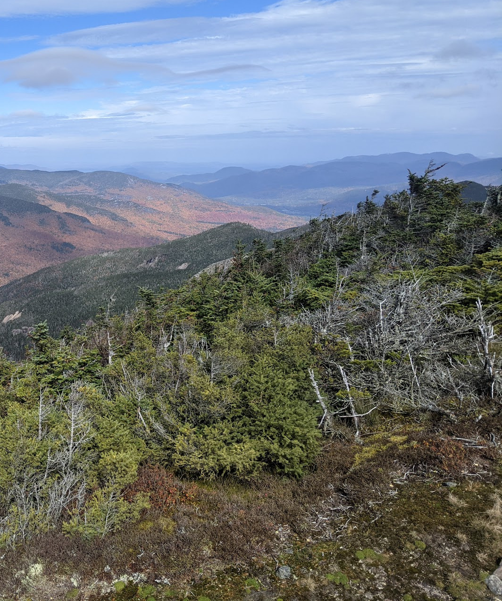
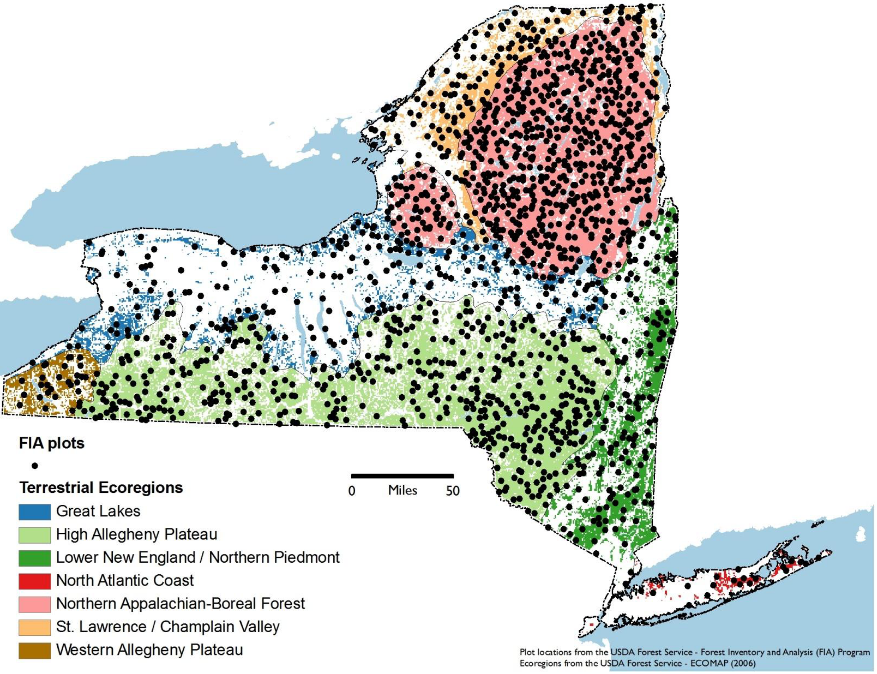
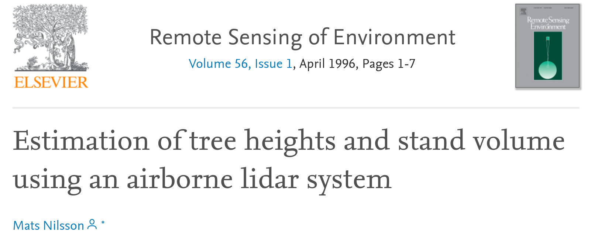
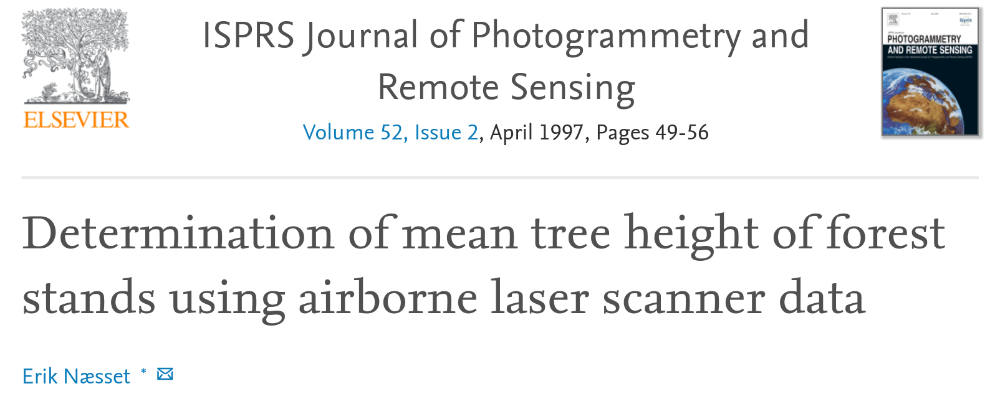

```{css echo=FALSE, include = FALSE}
.hide-count .remark-slide-number {
  display: none;
}
```

```{r setup, include=FALSE}
library(kableExtra)
options(htmltools.dir.version = FALSE)
knitr::opts_chunk$set(
  fig.width=9, fig.height=3.5, fig.retina=3,
  out.width = "100%",
  cache = FALSE,
  echo = FALSE,
  message = FALSE, 
  warning = FALSE,
  fig.show = TRUE,
  hiline = TRUE
)
xaringanExtra::use_webcam()
```

```{r xaringan-themer, include=FALSE, warning=FALSE}
library(xaringanthemer)
style_duo_accent(
  primary_color = "#26375b",
  secondary_color = "#27686d",
  inverse_header_color = "#FFFFFF"
)
```

class: hide-count

background-image: url("splash.png")  
background-size: contain

---

# About Me

.pull-left[

- Lucas Johnson

- Ph.D. Student at SUNY-ESF

- Focusing on mapping forest structure across New York State

- Background in machine learning, computer science

- https://www.lucaskjohnson.com/

]

.pull-right[

```{r, echo=FALSE}
knitr::include_graphics("https://www.lucaskjohnson.com/yosemite.jpeg")
```

]

---

## New York State 2019 CLCPA:

.pull-left[

### • 85% Reduction in GHG emissions by 2050  

### • Net zero emissions statewide by 2050

### • Lands & forests make up the difference

### • Need ways to track forest C sequestration

]

.pull-right[

```{r}

```

]

<br /> 

---

```{r}

```

<p style="font-size:8px">Figure from Shirer, R. and Zimmerman, C. (2010) Forest Regeneration in New York State. The Nature Conservancy.</p>

---

background-image: url("figures/landscape.png")
background-size: cover

---

background-image: url("figures/lidar_boundaries_map.png")
background-size: contain

---

background-image: url("figures/colored.png")
background-size: cover

---

background-image: url("figures/classed.png")
background-size: cover

---
class: center middle

```{r}


```

---
class: inverse center middle

# Objective 1:

### Does filtering ground noise help us model AGB?

---

background-image: url("figures/lidar_boundaries_map.png")
background-size: contain

---

background-image: url("figures/lulc_boundaries.png")
background-size: contain

---
class: inverse center middle

# Objective 2:

### Does ground noise filtering matter more in mixed-use landscapes?

---

## Our approach:

### • Filter LiDAR using 5 height thresholds

### • Fit random forests to each predictor set

### • Compare model performance

---

background-image: url("figures/distributions.jpg")
background-size: contain


---

background-image: url("figures/all_metrics.png")
background-size: contain

---

background-image: url("figures/lulc_boundaries.png")
background-size: contain

---

background-image: url("figures/fc.png")
background-size: contain

---

## Key Takeaways:

### • Ground noise filtering doesn't help and sometimes hurts AGB models

### • Impacts are greater in patchier, less-forested landscapes

### • Ground noise filtering should be avoided when modeling AGB

---

# Thank you!

This work was financially supported by the Climate & Applied Forest Research Institute at SUNY-ESF.

<br />

#### Find me online:

`r icons::fontawesome("github")` [@lucas-johnson](https://github.com/lucas-johnson/) 

`r icons::fontawesome("globe")` [www.lucaskjohnson.com](https://www.lucaskjohnson.com/)

<br />

